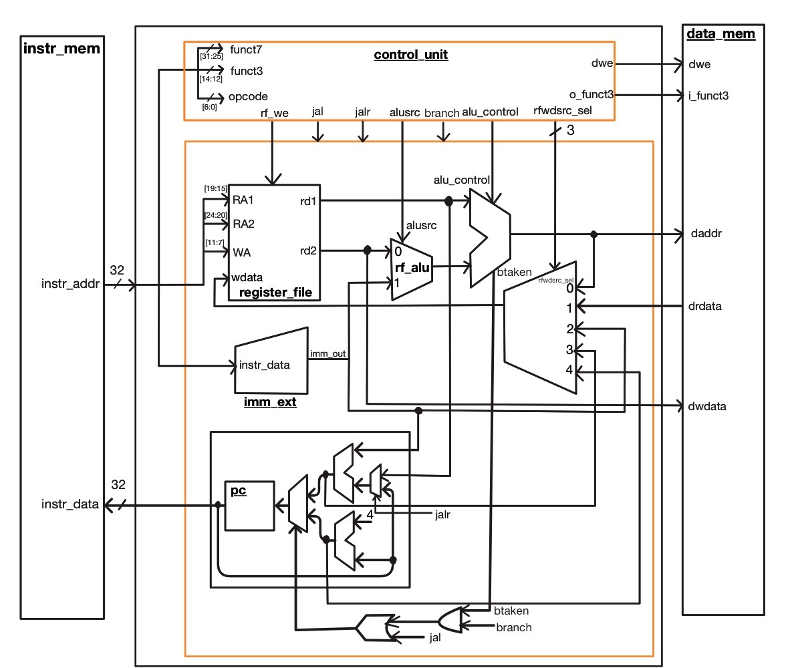
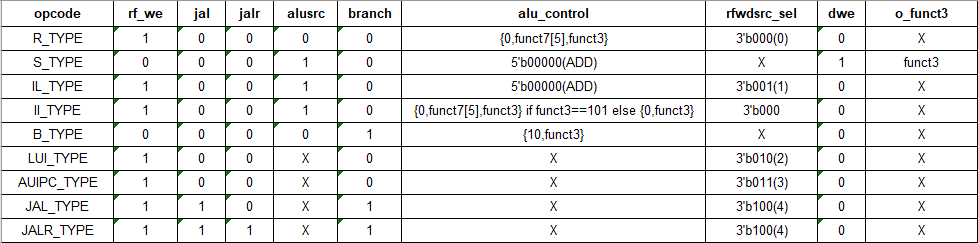
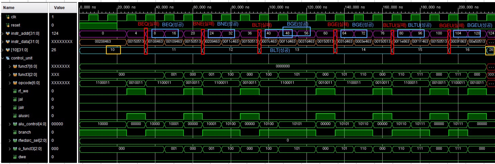
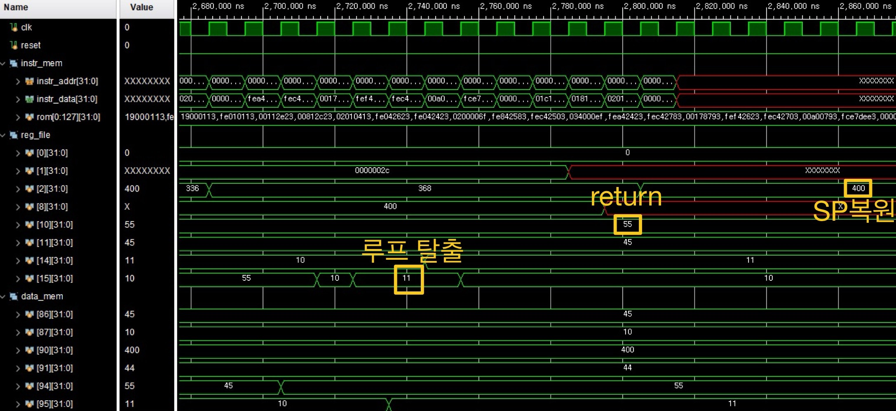
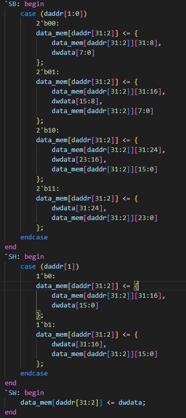
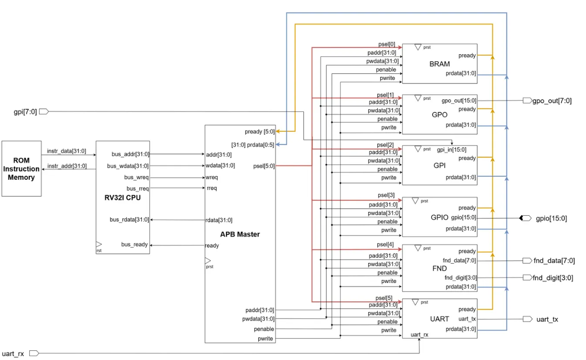
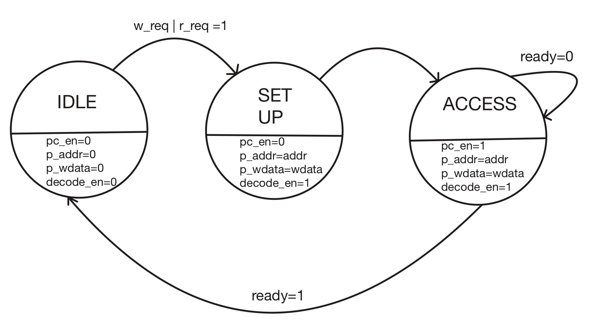
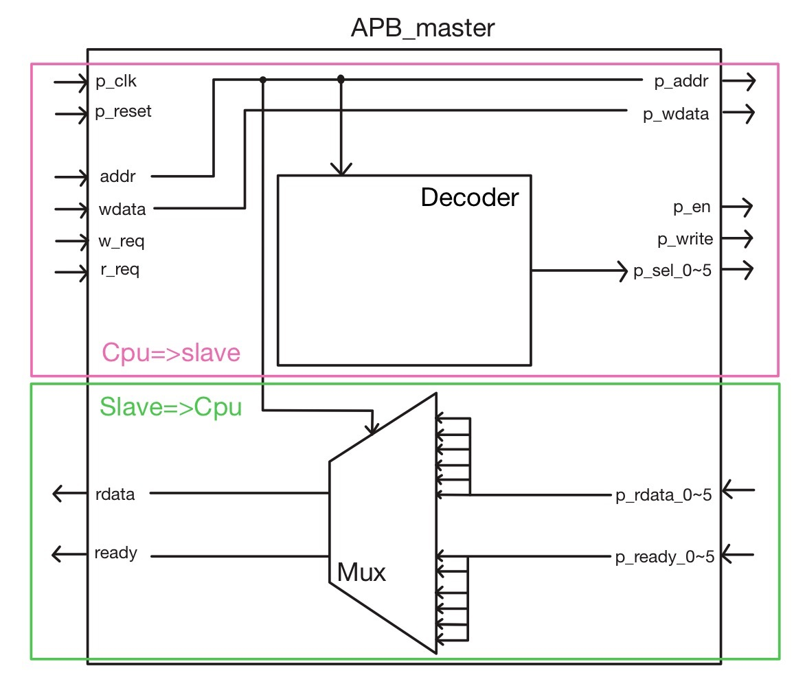
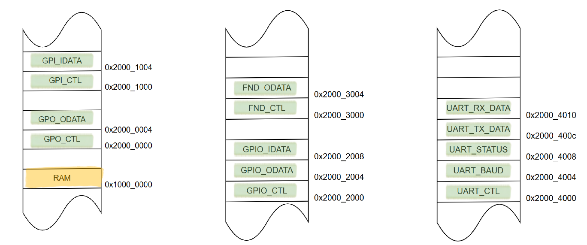

# RISC-V RV32I Processor & APB BUS

> RV32I ISA 기반 단일 사이클 프로세서를 직접 설계한 뒤, 멀티 사이클 구조와 AMBA APB 버스 기반 SoC로 확장한 프로젝트

---

## 📖 Overview

| | Part 1. Single Cycle | Part 2. Multi Cycle & APB BUS |
|---|---|---|
| 구분 | 개인 프로젝트 | 팀 프로젝트 (4인) |
| 기간 | 1개월 (~2026.03) | 1개월 (~2026.03) |
| 담당 | 전체 설계 및 검증 | **APB Master · RAM(APB Slave) 설계** |
| 목표 | RV32I 명령어 전체 구현 및 C 프로그램 실행 | 멀티 사이클 CPU에 주변장치 6종을 MMIO로 통합 |

| 개발 환경 | 사용 도구 |
|---|---|
| RTL 설계 | SystemVerilog |
| 합성 / 시뮬레이션 | Vivado |
| 펌웨어 | C (RISC-V GCC) |
| 보드 | Basys3 FPGA |

---

# Part 1. RV32I Single Cycle Processor

## 1.1 설계 목표

RV32I는 32개 범용 레지스터(x0~x31)와 32비트 고정폭 명령어를 갖는 Load/Store 구조의 ISA입니다.
모든 명령어가 같은 폭이라 디코딩이 단순하고, 메모리 접근은 LW/SW 계열만 담당합니다.
이 특성을 살려 **R / I / S / B / U / J 6개 타입의 명령어를 전부 구현**하고,
최종적으로 C 컴파일러가 생성한 프로그램이 그대로 동작하는 것까지 확인하는 것을 목표로 했습니다.

## 1.2 Block Diagram

<p align="center">
  <br>
  <em>Single Cycle Processor 전체 데이터패스</em>
</p>

| 모듈 | 역할 |
|---|---|
| `program_counter` | PC 관리 및 다음 주소 계산 |
| `register_file` | x0~x31 레지스터 |
| `imm_extender` | immediate 부호 확장 |
| `alu` | 산술 · 논리 · 분기 조건 연산 |
| `data_mem` | 데이터 메모리 R/W |
| `control_unit` | opcode, funct3, funct7 기반 제어신호 생성 |

## 1.3 Control Unit

opcode를 기준으로 9개 타입에 대한 제어신호를 생성합니다.
`alu_control`은 funct7[5]와 funct3를 조합해 결정하며, I-type의 시프트 연산(funct3 == 101)만
예외적으로 funct7을 함께 참조해 SRLI와 SRAI를 구분합니다.

<p align="center">
  <br>
  <em>Control Unit True Table — 타입별 제어신호</em>
</p>

## 1.4 명령어 타입별 구현 및 검증

각 타입마다 **시나리오 작성 → 예상값 계산 → 시뮬레이션 결과 대조** 순서로 검증했습니다.

| Type | 구현 명령어 | 검증 포인트 |
|---|---|---|
| **R** | ADD, SUB, AND, OR, XOR, SLL, SRL, SRA, SLT, SLTU | SRL/SRA의 논리·산술 시프트 차이, SLT/SLTU의 부호 유무 비교 |
| **B** | BEQ, BNE, BLT, BGE, BLTU, BGEU | 분기 성공/실패를 번갈아 배치해 PC+8 점프와 PC+4 진행을 모두 확인, signed/unsigned 비교 반전 검증 |
| **S** | SB, SH, SW | 1/2/4 byte 단위 저장이 메모리의 올바른 위치에 반영되는지 확인 |
| **I** | ADDI, SLTI, SLTIU, XORI, ORI, ANDI, SLLI, SRLI, SRAI | II_type(연산)과 IL_type(로드) 분리, 부호 확장 유무 확인 |
| **I (Load)** | LB, LBU, LH, LHU, LW | signed 로드의 부호 확장과 unsigned 로드의 zero 확장 결과 대조 |
| **U** | LUI, AUIPC | LUI+ADDI 조합으로 32비트 상수 완성, AUIPC의 PC 상대 주소 계산 |
| **J** | JAL, JALR | 복귀 주소(PC+4) 저장 및 JALR을 통한 복귀 흐름 확인 |

**검증 방식의 핵심**은 값이 서로 구분되는 시나리오를 의도적으로 설계한 것입니다.
예를 들어 B-type은 `x15 = -1(0xFFFFFFFF)`을 두고 signed 비교와 unsigned 비교의 결과가
정반대로 나오도록 구성해, 부호 처리 오류가 있으면 반드시 드러나게 했습니다.

<p align="center">
  <br>
  <em>B-type 시뮬레이션 — 분기 성공/실패에 따른 PC 변화</em>
</p>

## 1.5 C 프로그램 통합 시뮬레이션

명령어 단위 검증을 마친 뒤, C 컴파일러가 생성한 프로그램을 ROM에 올려 실행했습니다.

```c
int adder(int a, int b);
void main(void) {
    int i = 0;
    int sum = 0;
    while (i < 11) {
        sum = adder(i, sum);
        i = i + 1;
    }
    return;
}
int adder(int a, int b) { return a + b; }
```

단순 반복문이지만, **함수 호출이 포함되어 있어 스택 프레임 동작 전체를 검증**할 수 있습니다.

| 구간 | 확인 내용 |
|---|---|
| SP 초기화 | `sp = 400` → `addi sp, sp, -32` → `sp = 368` (32byte 프레임 확보) |
| 컨텍스트 저장 | `ra`, `s0`를 `data_mem[90]`, `[91]`에 저장 |
| 프레임 포인터 | `s0(fp) = sp + 32 = 400` 고정 — 지역변수 접근 기준점 |
| 루프 반복 | 함수 호출마다 `sp: 368 ↔ 336`, `s0: 400 ↔ 368` 왕복 |
| 루프 탈출 | `i = 11` → `ble` 조건 불만족 → `ra`, `s0` 복원 → `sp = 400` 복원 → `ret` |
| 최종 결과 | `reg[10] = 55` (0부터 10까지의 합) |

<p align="center">
  <br>
  <em>최종 결과 — 루프 탈출 후 reg[10] = 55</em>
</p>

## 1.6 Troubleshooting — SB/SH가 항상 하위 바이트에만 저장되는 문제

**증상**
`sb x20, 0(x0)`부터 `sb x20, 3(x0)`까지 오프셋을 바꿔가며 1바이트씩 저장했지만,
저장 위치가 바뀌지 않고 계속 같은 하위 8비트만 갱신됐습니다.

**원인**
`data_mem` 접근 시 `daddr[31:2]`만 사용하고 있었습니다.
이 값은 **word 단위 주소**라서 오프셋 0~3이 모두 같은 word를 가리키고,
바이트 위치를 결정하는 `daddr[1:0]`은 무시되고 있었습니다.

**해결**
`daddr[1:0]`으로 바이트 위치를 분기해 해당 자리에만 쓰도록 수정했습니다.

```systemverilog
// w = daddr[31:2] (word 주소)

// Before — daddr[1:0]을 무시해 항상 하위 8bit에만 저장
`SB: mem[w] <= { mem[w][31:8], dwdata[7:0] };

// After — daddr[1:0]으로 바이트 위치 선택
`SB: case (daddr[1:0])
       2'b00: mem[w] <= { mem[w][31:8],  dwdata[7:0]                };
       2'b01: mem[w] <= { mem[w][31:16], dwdata[15:8],  mem[w][7:0] };
       2'b10: mem[w] <= { mem[w][31:24], dwdata[23:16], mem[w][15:0]};
       2'b11: mem[w] <= { dwdata[31:24], mem[w][23:0]               };
     endcase
```

SH는 half-word 단위이므로 `daddr[1]` 하나로 상·하위 16비트를 구분했습니다.

<p align="center">
  <br>
  <em>수정 후 — 오프셋에 따라 mem[0]이 0xxx78 → 0x5678 → 0x345678 → 0x12345678로 채워짐</em>
</p>

**배운 점**
word align 구조에서 word 주소와 byte 주소를 구분하지 않으면,
시뮬레이션에서 "값이 들어가긴 하는" 상태로 보여 오류를 놓치기 쉽습니다.
오프셋을 하나씩 바꿔가며 저장 위치를 전수 확인하는 시나리오를 짰기 때문에 발견할 수 있었습니다.

---

# Part 2. Multi Cycle Processor & APB BUS

## 2.1 프로젝트 개요

단일 사이클 구조는 명령어 하나를 한 클럭에 처리하므로, 가장 오래 걸리는 명령어에
클럭 주기를 맞춰야 한다는 한계가 있습니다.
이를 개선하기 위해 명령어 실행을 **IF → ID → EX → MEM → WB** 단계로 나눈 멀티 사이클 구조로 재설계하고,
AMBA APB 버스를 통해 주변장치 4종(BRAM, GPIO, FND, UART)을 연결한 SoC를 구성했습니다.

<p align="center">
  <br>
  <em>전체 시스템 구조 — RV32I CPU · APB Master · APB Slave 6종</em>
</p>

**담당 파트**: APB Master(FSM · Address Decoder · Mux), RAM(APB Slave)

## 2.2 Multi Cycle CPU

| 단계 | 동작 |
|---|---|
| **FETCH** | ROM에서 명령어를 읽고 `pc_en`으로 PC 갱신 |
| **DECODE** | opcode 해석, 레지스터 파일 읽기, immediate 확장 |
| **EXECUTE** | ALU 연산 및 분기 시 PC 계산 |
| **MEMORY** | S-type: RAM에 Write / IL-type: RAM에서 Read |
| **WRITE BACK** | 연산 결과 또는 로드 데이터를 레지스터에 저장 |

<p align="center">
  <br>
  <em>단계별 수행 동작 — FETCH → DECODE → EXECUTE → MEMORY → WB</em>
</p>

명령어 타입에 따라 필요한 단계만 거치도록 FSM을 구성했습니다.
R/I/U/J 타입은 EXECUTE에서 바로 WRITE BACK으로, B/S 타입은 결과를 저장하지 않으므로
각각 EXECUTE, MEMORY에서 FETCH로 복귀합니다.
단계 사이에는 값을 유지하기 위한 파이프라인 레지스터를 배치했습니다.

## 2.3 APB Master *(담당)*

CPU와 APB Slave 사이를 중계하는 모듈로, 세 부분으로 구성했습니다.

### FSM — IDLE → SETUP → ACCESS

APB 프로토콜은 SETUP과 ACCESS 두 단계로 전송을 완료합니다.
CPU가 `w_req` 또는 `r_req`를 올리면 SETUP에서 주소와 데이터를 실어 `psel`을 assert하고,
ACCESS에서 `penable`을 올려 실제 전송을 수행합니다.

| 상태 | 주요 출력 |
|---|---|
| IDLE | `pc_en=0`, `p_addr=0`, `p_wdata=0`, `decode_en=0` |
| SETUP | `pc_en=1`, `p_addr=addr`, `p_wdata=wdata`, `decode_en=1` |
| ACCESS | `penable=1`, `pready=1`이면 IDLE 복귀 / `pready=0`이면 wait |

<p align="center">
  <br>
  <em>APB Master FSM — IDLE / SETUP / ACCESS 상태 전이</em>
</p>

### Address Decoder

`paddr` 상위 비트로 6개 Slave 중 하나를 선택합니다.

| Slave | Base Address | addr[31:28] | addr[14:12] |
|---|---|---|---|
| RAM | `0x1000_0000` | 4'h1 | — |
| GPO | `0x2000_0000` | 4'h2 | 3'h0 |
| GPI | `0x2000_1000` | 4'h2 | 3'h1 |
| GPIO | `0x2000_2000` | 4'h2 | 3'h2 |
| FND | `0x2000_3000` | 4'h2 | 3'h3 |
| UART | `0x2000_4000` | 4'h2 | 3'h4 |

주소 공간을 2단계로 나눈 이유는, 상위 4비트로 메모리 영역과 주변장치 영역을 먼저 구분하고
주변장치 내부는 `addr[14:12]`로 세분화해 **Slave를 추가할 때 디코더 수정 범위를 최소화**하기 위함입니다.

<p align="center">
  <br>
  <em>Address Decoder — PADDR 상위 비트로 6개 Slave 중 하나를 선택</em>
</p>

### Mux

선택된 Slave의 `prdata` / `pready`를 CPU로 되돌립니다.
`pready`는 FSM의 ACCESS 종료 조건으로도 사용되어, Slave가 준비될 때까지 wait 상태를 유지합니다.

<p align="center">
  <br>
  <em>APB Master 구조 — FSM · Decoder · Mux</em>
</p>

## 2.4 RAM (APB Slave) *(담당)*

| 항목 | 사양 |
|---|---|
| Base Address | `0x1000_0000` |
| 크기 | 4KB (1024 words) |
| 주소 처리 | `paddr[11:2]` — 하위 2비트는 제외(word align) |
| Write 조건 | `psel & penable & pwrite` |
| Read 조건 | `pwrite = 0` |
| `pready` | `psel & penable`이면 즉시 1 (Wait State 없음) |

## 2.5 Memory Mapped I/O 및 C Firmware

CPU 입장에서 주변장치는 특정 주소의 메모리로 보입니다.
따라서 별도의 I/O 명령어 없이 포인터 접근만으로 제어가 가능합니다.

```c
#define APB_BRAM   0x10000000
*(volatile unsigned int *) APB_BRAM = 0x00000001;   // sw a4, 0(a5)
i = *(volatile unsigned int *) APB_BRAM;            // lw a5, 0(a5)
```

`volatile`을 붙이는 이유는, 주변장치 레지스터 값이 CPU가 아닌 외부 요인으로도 바뀔 수 있어
컴파일러가 접근을 최적화로 제거하면 안 되기 때문입니다.

<p align="center">
  <br>
  <em>Memory Mapped I/O — 주변장치별 주소 배치</em>
</p>

## 2.6 검증 시나리오

각 Slave에 대해 C 코드 → 어셈블리 → APB 파형 순으로 대조하며 검증했습니다.

| 동작 | 주소 | 데이터 | 확인 |
|---|---|---|---|
| RAM Write | `0x1000_0004` | `0xABCD_1234` | `psel0=1`, `pwrite=1`, `pready0=1` |
| RAM Read | `0x1000_0000` | — | `rdata0 = 0x0000_0001` |
| GPO Write | `0x2000_0000` | `0x0000_00FF` | `psel1=1`, `pready1=1` |
| GPI Read | `0x2000_1004` | — | `prdata2 = 0x0000_00AA` |
| GPIO Write | `0x2000_2000` | `0x0000_FF00` | 상위 8bit LED 출력 / 하위 8bit SW 입력 모드 설정 |
| FND Write | `0x2000_3004` | `0x0000_270F` | `pready4=1` |
| UART Read | `0x2000_4010` | `uart_rx = 'Z'` | `prdata5 = 0x0000_005A` |

최종 통합 테스트는 **UART Echo-back**으로 진행했습니다.
PC에서 'A'(0x41), 'B'(0x42)를 순차 전송하면 CPU가 RXDATA를 읽어 다시 TXDATA로 되돌려 보내고,
동시에 그 값이 FND에도 표시되는지 확인해 APB 버스를 통한 다중 주변장치 동시 제어를 검증했습니다.

<p align="center">
  <br>
  <em>UART Echo-back 시뮬레이션</em>
</p>

## 2.7 Troubleshooting — MEMORY 단계에서 WB로 조기 진입

**증상**
IL-type(Load) 명령어 실행 시, RAM에서 읽은 값이 레지스터에 제대로 저장되지 않았습니다.

**원인**
APB Master Mux의 `ready` 신호가 CPU의 `ready` 입력에 그대로 연결되어 있었습니다.
그 결과 `ready = 1`이 되는 순간 CPU가 MEMORY 단계에서 곧바로 WB 단계로 넘어갔고,
WB 단계에서 RAM 읽기 요청(`dre`)을 assert하는 구조로는 이미 늦은 상태였습니다.

**해결**
읽기 요청 시점을 앞당겨 **MEMORY 단계에서 `dre`를 assert**하도록 제어신호 배치를 바꾸고,
WB 단계에서는 레지스터 쓰기(`rf_we`)와 write-back 소스 선택만 수행하도록 분리했습니다.

```systemverilog
// After
MEMORY: case (opcode)
          `S_TYPE : begin dwe = 1'b1; o_funct3 = funct3; end
          `IL_TYPE: begin dwe = 1'b0; dre = 1'b1; o_funct3 = funct3; end
        endcase
WB:     case (opcode)
          `IL_TYPE: begin rf_we = 1'b1; rfwd_src = 3'b001; end
        endcase
```

<p align="center">
  <br>
  <em>수정 전후 제어신호 배치 비교</em>
</p>

**배운 점**
버스의 handshake 신호를 CPU FSM의 상태 전이 조건으로 직접 쓸 때는,
그 신호가 올라오는 시점과 각 단계에서 필요한 동작의 순서를 함께 따져야 합니다.
단계별로 "무엇을 언제 assert하는가"를 다시 정리하면서 멀티 사이클 제어의 타이밍을 체감했습니다.

---

## 📁 File Structure

```
├── SingleCycle/
│   ├── rtl/
│   │   ├── program_counter.sv
│   │   ├── register_file.sv
│   │   ├── imm_extender.sv
│   │   ├── alu.sv
│   │   ├── control_unit.sv
│   │   ├── data_mem.sv
│   │   └── cpu_top.sv
│   └── sim/
├── MultiCycle_APB/
│   ├── rtl/
│   │   ├── apb_master.sv        # 담당
│   │   ├── apb_ram.sv           # 담당
│   │   ├── apb_gpio.sv
│   │   ├── apb_fnd.sv
│   │   ├── apb_uart.sv
│   │   └── mcu_top.sv
│   ├── firmware/
│   └── sim/
└── docs/
```

---

## 📑 발표 자료

- 📄 [RV32I Single Cycle 설계 및 시뮬레이션](docs/slides/RISC_V_personal.pdf)
- 📄 [Multi Cycle CPU & APB BUS 팀 프로젝트](docs/slides/RISC-V%20team_project.pdf)

---

## 🔗 Related

- [전체 포트폴리오](https://github.com/Yoonjiwon-0305)
